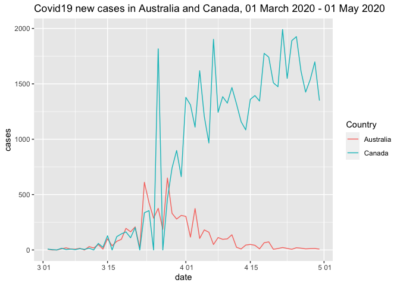

<!-- README.md is generated from README.Rmd. Please edit that file -->

# covidpkg

<!-- badges: start -->

<!-- badges: end -->

The goal of covidpkg is to provide dataset and functions to visualising
and analysing the number of COVID19 cases and deaths in Australia and
Canada.

## Installation

You can install the released version of covidpkg from
[CRAN](https://CRAN.R-project.org) with:

``` r
install.packages("covidpkg")
```

And the development version from [GitHub](https://github.com/) with:

``` r
# install.packages("devtools")
devtools::install_github("etc5523-2020/r-package-assessment-YuqiWang517")
```

## Example

This is a basic example which shows you one of the plot for COVID19:

``` r
library(covidpkg)
library(tidyverse)
#> ─ Attaching packages ───────────────────────────────────────────── tidyverse 1.3.0 ─
#> ✓ ggplot2 3.3.2     ✓ purrr   0.3.4
#> ✓ tibble  3.0.3     ✓ dplyr   1.0.1
#> ✓ tidyr   1.1.1     ✓ stringr 1.4.0
#> ✓ readr   1.4.0     ✓ forcats 0.5.0
#> ─ Conflicts ─────────────────────────────────────────────── tidyverse_conflicts() ─
#> x dplyr::filter() masks stats::filter()
#> x dplyr::lag()    masks stats::lag()
library(lubridate)
#> 
#> Attaching package: 'lubridate'
#> The following objects are masked from 'package:base':
#> 
#>     date, intersect, setdiff, union
covid <- read.csv("inst/app/data/WHO-COVID-19-global-data.csv") %>%
  filter(Country %in%c("Canada", "Australia"))
covid1 <- covid %>% mutate(date= as.Date(Date_reported, format = "%Y-%m-%d")) %>%
  filter(Country %in% c("Canada", "Australia")) %>%
  filter(date > "2020-03-01" & date < "2020-05-01") %>%
  select(date, Country, cases = New_cases) %>%
  group_by(Country)
ggplot(data = covid1, aes(x = date, y = cases, color = Country)) +
      geom_line() +
      ggtitle("Covid19 new cases in Australia and Canada, 01 March 2020 - 01 May 2020") 
```


